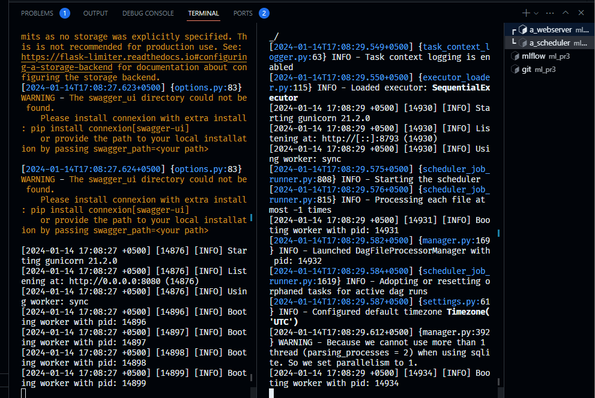
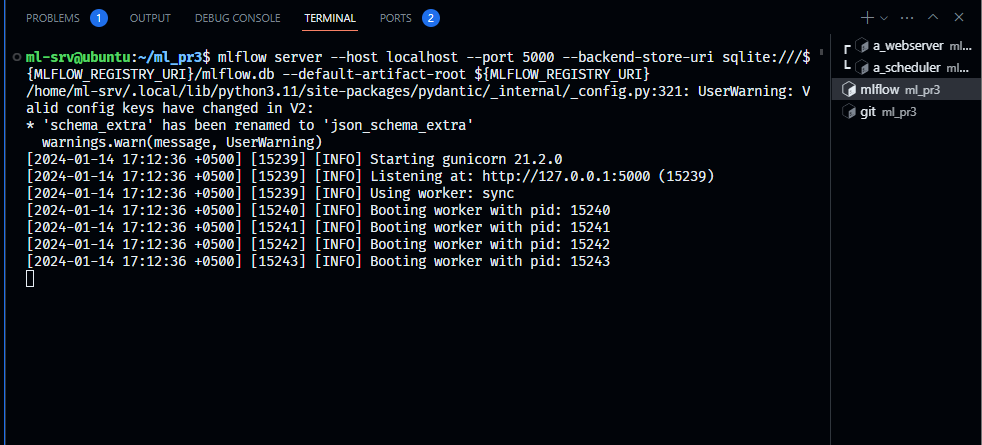

# Практическая работа #3

## Что нужно сделать:

- [x] Определить внешний источник получения данных и способ получения этих данных (http, curl, wget, API, SQL, SparQL, ...);
- [x] Поставить задачу для алгоритма машинного обучения, выбрать модель и метрику
- [x] Создать инфраструктуру (например, виртуальные машины VirtualBox), установить и настроить для работы необходимое ПО, в том числе airflow и mlflow, а также venv для организации работы виртуального окружения
- [x] Создать Python скрипты для:
    - [x] Получения данных из внешнего источника;
    - [x] Преобразования данных;
    - [x] Формирования рабочего набора данных для обучения (train) и тестирования (test) модели;
    - [x] Обучения модели на тренировочных (train) данных и ее сохранения;
    - [x] Загрузки модели и проверки качества ее работы на тестовых (test) данных.
- [x] Добавить код airflow, позволяющий создавать и запускать на регулярной основе описанные операции проекта;
- [x] Добавить код mlflow, позволяющий осуществлять мониторинг хода выполнения конвейера, сохранять и анализировать полученные артефакты.

## Предполагаемый результат

В результате выполнения задачи необходимо создать и предъявить для проверки git репозиторий, который содержит весь исходный код и необходимые конфигурационные файлы для воссоздания условия выполнения эксперимента проверяющим (например, requirements.txt)

## Команды

Перед запуском `airflow` необходимо выполнить следующую команду в терминале `export AIRFLOW_HOME=/home/ml-srv/ml_pr3/airflow`.

Перед запуском `mlflow` необходимо выполнить следующую команду в терминале `export MLFLOW_REGISTRY_URI=mlflow`.

Команда запуска `mlflow`:
```bash
mlflow server --host localhost --port 5000 \
--backend-store-uri sqlite:///${MLFLOW_REGISTRY_URI}/mlflow.db \
--default-artifact-root ${MLFLOW_REGISTRY_URI}
```

## Задача для алгоритма машинного обучения, модель и метрика

Данная работа нацелена на изучение рейтинга канала на платформе YouTube по количеству лайков на видео.

## Запуск проекта

В папке со скриптами описан файл `get_data0.py`. Для запуска проекта необходимо создать копию данного скрипта и переименовать в `get_data.py`. При этом в скопированном файле необходимо ввести токен для работы с API YouTube на свой:

```python
try:
    import sys

    sys.path.insert(0, "..")
    from config.tokens import youtube_api_token
except Exception:
    # My YouTube API Token
    youtube_api_token = ""
```

## Скриншоты

Запуск Airflow Webserver & Scheduler.


Запуск MLflow.


Выполненная ETL процесс на Airflow Webserver.


MLflow Webserver.

